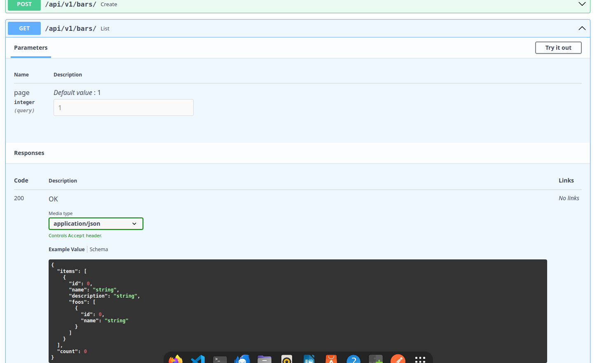

# 🥷 django-ninja-aio-crud

[](https://codecov.io/gh/caspel26/django-ninja-aio-crud)
[](https://pypi.org/project/django-ninja-aio-crud/)
[](https://github.com/caspel26/django-ninja-aio-crud/blob/main/LICENSE)
[](https://github.com/astral-sh/ruff)
> [!NOTE]
> Django ninja aio crud framework is based on **<a href="https://django-ninja.dev/">Django Ninja framework</a>**. It comes out with built-in views and models which are able to make automatic async CRUD operations and codes views class based making the developers' life easier and the code cleaner.

## 📝 Instructions

### 📚 Prerequisites

- Install Python from the [official website](https://www.python.org/) (latest version) and ensure it is added to the system Path and environment variables.

### 💻 Setup your environment

- Create a virtual environment
```bash
python -m venv .venv
```

### ✅ Activate it

- If you are from linux activate it with

```bash
. .venv/bin/activate
```

- If you are from windows activate it with

```bash
. .venv/Scripts/activate
```

### 📥 Install package

```bash
pip install django-ninja-aio-crud
```

## 🚀 Usage

> [!TIP]
> If you find **django ninja aio crud** useful, consider :star: this project
> and why not ... [Buy me a coffee](https://buymeacoffee.com/caspel26)

### ModelSerializer

- You can serialize your models using ModelSerializer and made them inherit from it. In your models.py import ModelSerializer
```python
# models.py
from django.db import models
from ninja_aio.models import ModelSerializer


class Foo(ModelSerializer):
  name = models.CharField(max_length=30)
  bar = models.CharField(max_length=30)

  class ReadSerializer:
    fields = ["id", "name", "bar"]

  class CreateSerializer:
    fields = ["name", "bar"]

  class UpdateSerializer:
    fields = ["name", "bar"]
```

- ReadSerializer, CreateSerializer, UpdateSerializer are used to define which fields would be included in runtime schemas creation. You can also specify custom fields and handle their function by overriding custom_actions ModelSerializer's method(custom fields are only available for Create and Update serializers).

```python
# models.py
from django.db import models
from ninja_aio.models import ModelSerializer


class Foo(ModelSerializer):
  name = models.CharField(max_length=30)
  bar = models.CharField(max_length=30)
  active = models.BooleanField(default=False)

  class ReadSerializer:
    fields = ["id", "name", "bar"]

  class CreateSerializer:
    customs = [("force_activation", bool, False)]
    fields = ["name", "bar"]

  class UpdateSerializer:
    fields = ["name", "bar"]

  async def custom_actions(self, payload: dict[str, Any]):
      if not payload.get("force_activation"):
          return
      setattr(self, "force_activation", True)

  async def post_create(self) -> None:
      if not hasattr(self, "force_activation") or not getattr(self, "force_activation"):
          return
      self.active = True
      await self.asave()
```

- post create method is a custom method that comes out to handle actions which will be excuted after that the object is created. It can be used, indeed, for example to handle custom fields' actions.

- You can also define optional fields for you Create and Update serializers (remember to give your optional fields a default). To declare an optional fields you have to give the field type too.
```python
# models.py
from django.db import models
from ninja_aio.models import ModelSerializer


class Foo(ModelSerializer):
  name = models.CharField(max_length=30)
  bar = models.CharField(max_length=30, default="")
  active = models.BooleanField(default=False)

  class ReadSerializer:
    fields = ["id", "name", "bar"]

  class CreateSerializer:
    fields = ["name"]
    optionals = [("bar", str), ("active", bool)]

  class UpdateSerializer:
    optionals = [("bar", str), ("active", bool)]
```

- Instead of declaring your fields maybe you want to exclude some of them. Declaring "excludes" attribute into serializers will exclude the given fields. (You can declare only one between "fields" and "excludes").

```python
# models.py
from django.db import models
from ninja_aio.models import ModelSerializer


class Foo(ModelSerializer):
  name = models.CharField(max_length=30)
  bar = models.CharField(max_length=30, default="")
  active = models.BooleanField(default=False)

  class ReadSerializer:
    excludes = ["bar"]

  class CreateSerializer:
    fields = ["name"]
    optionals = [("bar", str), ("active", bool)]

  class UpdateSerializer:
    excludes = ["id", "name"]
    optionals = [("bar", str), ("active", bool)]
```


### APIViewSet

- View class used to automatically generate CRUD views. in your views.py import APIViewSet and define your api using NinjaAIO class. NinjaAIO class uses built-in parser and renderer which use orjson for data serialization.

```python
# views.py
from ninja_aio import NinjaAIO
from ninja_aio.views import APIViewSet

from .models import Foo

api = NinjaAIO()


class FooAPI(APIViewSet):
  model = Foo
  api = api


FooAPI().add_views_to_route()
```

- and that's it, your model CRUD will be automatically created. You can also add custom views to CRUD overriding the built-in method "views".

```python
# views.py
from ninja import Schema
from ninja_aio import NinjaAIO
from ninja_aio.views import APIViewSet

from .models import Foo

api = NinjaAIO()


class ExampleSchemaOut(Schema):
  sum: float


class ExampleSchemaIn(Schema):
  n1: float
  n2: float


class FooAPI(APIViewSet):
  model = Foo
  api = api

  def views(self):
    @self.router.post("numbers-sum/", response={200: ExampleSchemaOut})
    async def sum(request: HttpRequest, data: ExampleSchemaIn):
        return 200, {sum: data.n1 + data.n2}


FooAPI().add_views_to_route()
```

- You can also choose to disable any operation from crud by declaring "disbale" attribute. You can give "all" to disable every crud operation except for additional views.

> [!TIP]
> You can exclude by default an endpoint without declaring the serializer.
> For example if you don't want to give update method to a CRUD just do not declare UpdateSerializer into model.

```python
# views.py
from ninja_aio import NinjaAIO
from ninja_aio.views import APIViewSet

from .models import Foo

api = NinjaAIO()


class FooAPI(APIViewSet):
  model = Foo
  api = api
  disable = ["retrieve", "update"]


FooAPI().add_views_to_route()
```
For the list endpoint you can also set query params and handle them. They will be also visible into swagger.

```python
# views.py
from ninja_aio import NinjaAIO
from ninja_aio.views import APIViewSet

from .models import Foo

api = NinjaAIO()


class FooAPI(APIViewSet):
  model = Foo
  api = api
  query_params = {"name": (str, None), "active": (bool, None)}

  async def query_params_handler(self, queryset, filters):
      return queryset.filter(**{k: v for k, v in filters.items() if v is not None})


FooAPI().add_views_to_route()
```

### APIView

- View class to code generic views class based. In your views.py import APIView class.

```python
# views.py
from ninja import Schema
from ninja_aio import NinjaAIO
from ninja_aio.views import APIView

api = NinjaAIO()


class ExampleSchemaOut(Schema):
  sum: float


class ExampleSchemaIn(Schema):
  n1: float
  n2: float


class SumView(APIView):
  api = api
  api_router_path = "numbers-sum/"
  router_tag = "Sum"

  def views(self):
    @self.router.post("/", response={200: ExampleSchemaOut})
    async def sum(request: HttpRequest, data: ExampleSchemaIn):
        return 200, {sum: data.n1 + data.n2}


SumView().add_views_to_route()
```

### Relations
- You can also set ForeignKey, OneToOne and ManyToMany relations into serialization(reverse relations are supported too). Django ninja aio crud will serialize every of these relation automatically.

- Define models:

```python
# models.py
class Bar(ModelSerializer):
    name = models.CharField(max_length=30)
    description = models.TextField(max_length=30)

    # ReadSerializer with reverse OneToMany relation (foos)
    class ReadSerializer:
        fields = ["id", "name", "description", "foos"]

    class CreateSerializer:
        fields = ["name", "description"]

    class UpdateSerializer:
        fields = ["name", "description"]


class Foo(ModelSerializer):
    name = models.CharField(max_length=30)
    bar = models.ForeignKey(Bar, on_delete=models.CASCADE, related_name="foos")

    class ReadSerializer:
        fields = ["id", "name", "bar"]

    class CreateSerializer:
        fields = ["name", "bar"]

    class UpdateSerializer:
        fields = ["name"]
```

- Define views:

```python
# views.py
from ninja_aio import NinjaAIO
from ninja_aio.views import APIViewSet

from .models import Foo, Bar

api = NinjaAIO()


class FooAPI(APIViewSet):
  model = Foo
  api = api


class BarAPI(APIViewSet):
  model = Bar
  api = api


FooAPI().add_views_to_route()
BarAPI().add_views_to_route()
```

- Now run your server and go to /docs url:

### Docs

- Foo Schemas


- Bar Schemas with reverse relation



## 🔒 Authentication

### Jwt

- AsyncJWTBearer built-in class is an authenticator class which use joserfc module. It cames out with authenticate method which validate given claims. Override auth handler method to write your own authentication method. Default algorithms used is RS256. a jwt Token istance is set as class atribute so you can use it by self.dcd.

```python
from ninja_aio.auth import AsyncJWTBearer
from django.conf import settings
from django.http import HttpRequest

from .models import Foo


class CustomJWTBearer(AsyncJWTBearer):
    jwt_public = settings.JWT_PUBLIC
    claims = {"foo_id": {"essential": True}}

    async def auth_handler(self, request: HttpRequest):
      try:
        request.user = await Foo.objects.aget(id=self.dcd.claims["foo_id"])
      except Foo.DoesNotExist:
        return None
      return request.user
```

- Then add it to views.

```python
# views.py
from ninja import Schema
from ninja_aio import NinjaAIO
from ninja_aio.views import APIViewSet, APIView

from .models import Foo

api = NinjaAIO()


class FooAPI(APIViewSet):
  model = Foo
  api = api
  auths = CustomJWTBearer()


class ExampleSchemaOut(Schema):
  sum: float


class ExampleSchemaIn(Schema):
  n1: float
  n2: float


class SumView(APIView):
  api = api
  api_router_path = "numbers-sum/"
  router_tag = "Sum"
  auths = CustomJWTBearer()

  def views(self):
    @self.router.post("/", response={200: ExampleSchemaOut}, auth=self.auths)
    async def sum(request: HttpRequest, data: ExampleSchemaIn):
        return 200, {sum: data.n1 + data.n2}


FooAPI().add_views_to_route()
SumView().add_views_to_route()
```

## 📝 Pagination

- By default APIViewSet list view uses Django Ninja built-in AsyncPagination class "PageNumberPagination". You can customize and assign it to APIViewSet class. To make your custom pagination consult **<a href="https://django-ninja.dev/guides/response/pagination/#async-pagination">Django Ninja pagination documentation</a>**.

```python
# views.py

class FooAPI(APIViewSet):
  model = Foo
  api = api
  pagination_class = CustomPaginationClass

```

## 📌 Notes
- Feel free to contribute and improve the program. 🛠️
