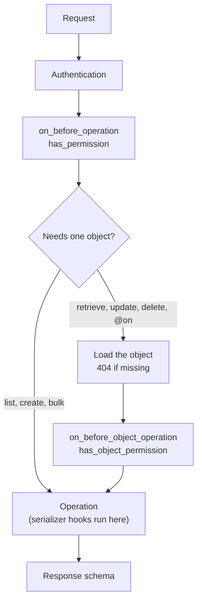

# Request lifecycle

Every generated endpoint runs the same steps. Knowing the order tells you
where to put your code.

## The steps

| Step | What happens | Your code |
| --- | --- | --- |
| Authentication | The auth class checks the request. A failure returns `401`. | `auth_handler` |
| Operation check | Runs before any database work. | `on_before_operation`, `has_permission` |
| Object loading | For endpoints on one object. A missing object returns `404`. | `queryset_request` scopes the lookup |
| Object check | Runs with the loaded object. | `on_before_object_operation`, `has_object_permission` |
| Operation | Validates input, writes to the database and runs the serializer hooks. | See below |
| Response | The result is dumped with the response schema. | `ReadValidators`, `DetailValidators` |

Async viewsets call the `a`-prefixed version of each hook.

## Inside the operation

| Operation | Order |
| --- | --- |
| Create | `on_create_before_save`, `before_save`, save, `on_create_after_save`, `after_save`, `custom_actions`, `post_create`, `@on_create`, nested children |
| Update | set the fields you sent, `custom_actions`, `before_save`, save, `after_save`, `@on_update` |
| Delete | delete, `on_delete`, `@on_delete` |
| List | `queryset_request`, `on_list_queryset`, filters, ordering, pagination |

The same order applies to the Python methods, like `Article.create()`, except
for the viewset steps: authentication and the permission checks only run for
HTTP requests.

## Where to put your code

| You want to | Use |
| --- | --- |
| Reject a request before touching the database | `has_permission` |
| Reject based on the object | `has_object_permission` |
| Show each user only some rows | `queryset_request` or `get_permission_queryset` |
| Change a value before it's saved | `before_save` or a validator |
| React to a custom input field | `custom_actions` |
| Send a notification after creation | `post_create` or `@on_create` |
| React when one field changes | `@on_update("field")` |

## See also

- [Hooks](../guides/hooks.md)
- [Permissions](../guides/permissions.md)
- [Viewsets](../guides/viewsets.md)
