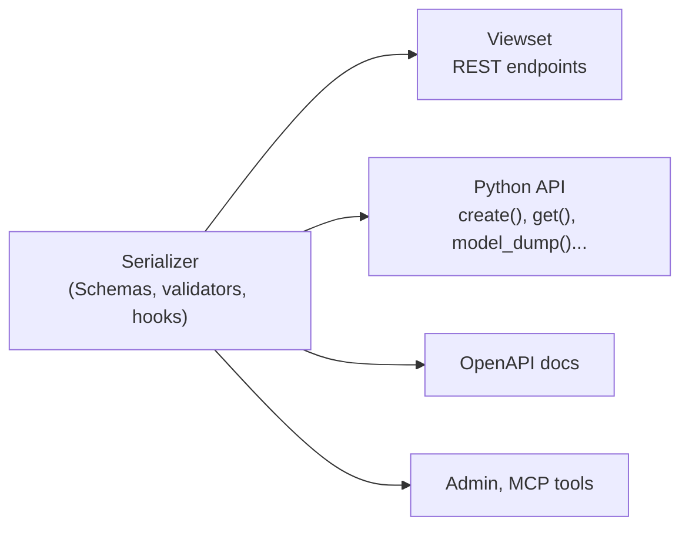

# Serializer first

Your serializer is the single place where you describe a resource. Everything
else is built from it.



## One description, many uses

The `Schemas` class, the validators and the hooks you write on a serializer
are used by:

- The viewset, for the `POST`, `GET`, `PATCH` and `DELETE` endpoints.
- The Python methods, like `Article.create()` or `Article.amodel_dump()`.
- The OpenAPI schema and the interactive docs.
- Integrations such as the [Django admin](../guides/admin.md) and
  [MCP tools](../guides/mcp.md).

So a validator you add to `CreateValidators` runs for the `POST` endpoint and
for `Article.create()` in a script. A hook you add runs for both too.

## The viewset is thin

A viewset decides *how* the resource is exposed: URLs, authentication,
permissions, filters and pagination. It doesn't decide *what* is valid or what
happens when an object is saved. That lives on the serializer.

```python
@api.viewset(model=Article)
class ArticleViewSet(APIViewSet):
    auth = [JWTAuth()]
    ordering_fields = ["created_at"]
```

## Two ways to write the serializer

| Style | Where it lives |
| --- | --- |
| `ModelSerializer` | On the Django model itself |
| `Serializer` | In a separate class that points to a model with `Meta.model` |

Both styles have the same `Schemas`, validators, hooks and Python methods. See
[choosing a serializer](../getting_started/choosing-a-serializer.md).

## See also

- [Use the CRUD API from Python](../guides/python-crud.md)
- [Viewsets](../guides/viewsets.md)
- [Schemas](../guides/schemas.md)
