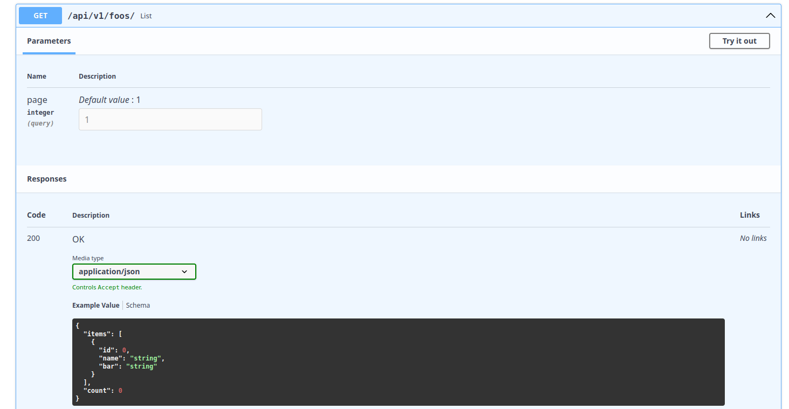

## 🚀 Quick Start

### 1. Create Your Model

Define your model using `ModelSerializer`:

```python
# models.py
from django.db import models
from ninja_aio.models import ModelSerializer


class Article(ModelSerializer):
    title = models.CharField(max_length=200)
    content = models.TextField()
    is_published = models.BooleanField(default=False)
    created_at = models.DateTimeField(auto_now_add=True)

    class ReadSerializer:
        fields = ["id", "title", "content", "is_published", "created_at"]

    class CreateSerializer:
        fields = ["title", "content"]
        optionals = [("is_published", bool)]

    class UpdateSerializer:
        optionals = [
            ("title", str),
            ("content", str),
            ("is_published", bool),
        ]
```

### 2. Create Your ViewSet

Define your API views using `APIViewSet`:

```python
# views.py
from ninja_aio import NinjaAIO
from ninja_aio.views import APIViewSet
from .models import Article

api = NinjaAIO(title="My Blog API", version="1.0.0")


class ArticleViewSet(APIViewSet):
    model = Article
    api = api


ArticleViewSet().add_views_to_route()
```

### 3. Configure URLs

Add the API to your URL configuration:

```python
# urls.py
from django.urls import path
from .views import api

urlpatterns = [
    path("api/", api.urls),
]
```

### 4. Run Your Server

```bash
python manage.py runserver
```

Visit **[http://localhost:8000/api/docs](http://localhost:8000/api/docs)** to see your auto-generated API documentation!

## 📸 Generated API Documentation

### Endpoints Overview


Your API automatically includes:

| Method | Endpoint | Description |
|--------|----------|-------------|
| `GET` | `/article/` | List all articles (paginated) |
| `POST` | `/article/` | Create new article |
| `GET` | `/article/{id}` | Retrieve single article |
| `PATCH` | `/article/{id}/` | Update article |
| `DELETE` | `/article/{id}/` | Delete article |

### List Endpoint



Features:
- Automatic pagination
- Query parameter filtering
- Sorting support

### Create Endpoint


Features:
- Input validation
- Custom field support
- Relationship handling

### Retrieve Endpoint


Features:
- Nested relationship serialization
- Optimized queries

### Update Endpoint


Features:
- Partial updates (PATCH)
- Field-level validation
- Custom actions

### Delete Endpoint


Features:
- Soft delete support
- Cascade handling
- Custom hooks
