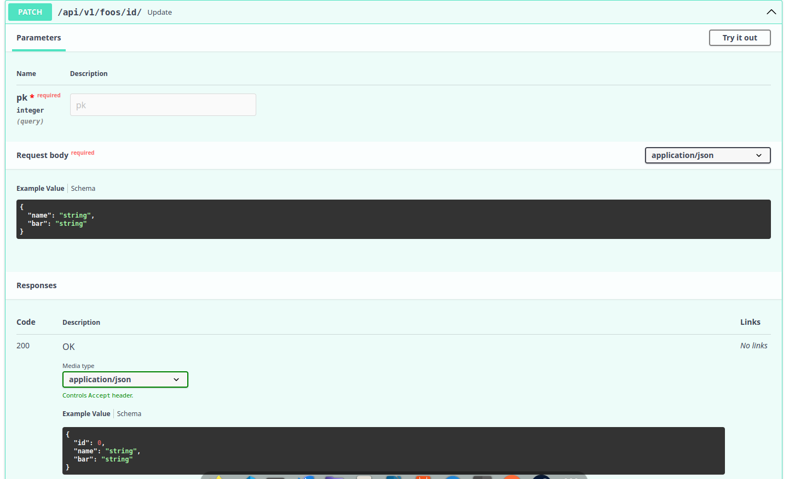

## :material-rocket-launch: Quick Start (ModelSerializer)

This guide shows how to create a CRUD API using `ModelSerializer`, which combines your Django model and serialization configuration in a single class.

!!! tip "Alternative Approach"
    If you prefer to keep your models unchanged and define serialization separately, see [Quick Start (Serializer)](quick_start_serializer.md).

### 1. Create Your Model

Define your model using `ModelSerializer` with embedded serializer configuration:

```python
# models.py
from django.db import models
from ninja_aio.models import ModelSerializer


class Article(ModelSerializer):
    title = models.CharField(max_length=200)
    content = models.TextField()
    is_published = models.BooleanField(default=False)
    created_at = models.DateTimeField(auto_now_add=True)

    class ReadSerializer:
        fields = ["id", "title", "content", "is_published", "created_at"]

    class CreateSerializer:
        fields = ["title", "content"]
        optionals = [("is_published", bool)]

    class UpdateSerializer:
        optionals = [
            ("title", str),
            ("content", str),
            ("is_published", bool),
        ]
```

### 2. Create Your ViewSet

Define your API views using `APIViewSet`:

```python
# views.py
from ninja_aio import NinjaAIO
from ninja_aio.views import APIViewSet
from .models import Article

api = NinjaAIO(title="My Blog API", version="1.0.0")


@api.viewset(model=Article)
class ArticleViewSet(APIViewSet):
    pass
```

### 3. Configure URLs

Add the API to your URL configuration:

```python
# urls.py
from django.urls import path
from .views import api

urlpatterns = [
    path("api/", api.urls),
]
```

### 4. Run Your Server

```bash
python manage.py runserver
```

Visit **[http://localhost:8000/api/docs](http://localhost:8000/api/docs)** to see your auto-generated API documentation!

## :material-camera: Generated API Documentation

### Endpoints Overview


Your API automatically includes:

| Method | Endpoint | Description |
|--------|----------|-------------|
| `GET` | `/article/` | List all articles (paginated) |
| `POST` | `/article/` | Create new article |
| `GET` | `/article/{id}` | Retrieve single article |
| `PATCH` | `/article/{id}/` | Update article |
| `DELETE` | `/article/{id}/` | Delete article |

### :material-format-list-bulleted: List Endpoint


- :material-book-multiple: Automatic pagination
- :material-filter: Query parameter filtering
- :material-sort: Sorting support

### :material-plus-circle: Create Endpoint


- :material-check-circle: Input validation
- :material-pencil-plus: Custom field support
- :material-link-variant: Relationship handling

### :material-eye: Retrieve Endpoint


- :material-file-tree: Nested relationship serialization
- :material-lightning-bolt: Optimized queries

### :material-pencil: Update Endpoint



- :material-file-document-edit: Partial updates (PATCH)
- :material-shield-check: Field-level validation
- :material-cog: Custom actions

### :material-delete: Delete Endpoint


- :material-delete-sweep: Soft delete support
- :material-sitemap: Cascade handling
- :material-hook: Custom hooks

---

## :material-arrow-right-circle: Next Steps

<div class="grid cards" markdown>

-   :material-file-document-edit:{ .lg .middle } **ModelSerializer Reference**

    ---

    Deep dive into all ModelSerializer features

    [:octicons-arrow-right-24: Learn more](../api/models/model_serializer.md)

-   :material-view-grid:{ .lg .middle } **APIViewSet Features**

    ---

    Custom endpoints, pagination, and filtering

    [:octicons-arrow-right-24: Explore](../api/views/api_view_set.md)

-   :material-shield-lock:{ .lg .middle } **Authentication**

    ---

    Add JWT authentication to your API

    [:octicons-arrow-right-24: Add auth](../api/authentication.md)

-   :material-school:{ .lg .middle } **Full Tutorial**

    ---

    Step-by-step guide covering all features

    [:octicons-arrow-right-24: Start tutorial](../tutorial/model.md)

</div>
