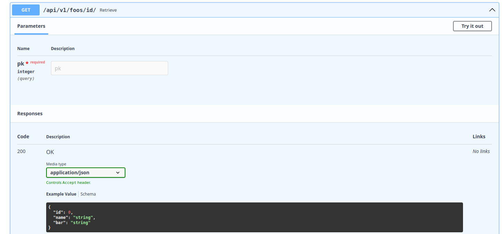

<!-- # Welcome to MkDocs

For full documentation visit [mkdocs.org](https://www.mkdocs.org).

## Commands

* `mkdocs new [dir-name]` - Create a new project.
* `mkdocs serve` - Start the live-reloading docs server.
* `mkdocs build` - Build the documentation site.
* `mkdocs -h` - Print help message and exit.

## Project layout

    mkdocs.yml    # The configuration file.
    docs/
        index.md  # The documentation homepage.
        ...       # Other markdown pages, images and other files. -->

# Django Ninja Aio CRUD - Rest Framework

Django Ninja Aio CRUD is a web framework based on **<a href="https://django-ninja.dev/">Django Ninja framework</a>**(developed by **<a href="https://github.com/vitalik">Vitaliy Kucheryaviy</a>**). It comes out from the purpose to make fast coding async CRUD operations. It comes out with built-in views, model and some utilities like JWT authentication class.

## Installation
```bash
pip install django-ninja-aio-crud
```

## Quick Usage Example

Start a new Django project and define your models using ModelSerializer class

```Python
# models.py
from django.db import models
from ninja_aio.models import ModelSerializer


class Foo(ModelSerializer):
  name = models.CharField(max_length=30)
  bar = models.CharField(max_length=30)
 
  class ReadSerializer:
    fields = ["id", "name", "bar"]

  class CreateSerializer:
    fields = ["name", "bar"]

  class UpdateSerializer:
    fields = ["name", "bar"]
```

Define your CRUD views using APIViewSet class and your API with NinjaAIO class

```Python
# views.py
from ninja_aio import NinjaAIO
from ninja_aio.views import APIViewSet

from .models import Foo

api = NinjaAIO()


class FooAPI(APIViewSet):
  model = Foo
  api = api

  
FooAPI().add_views_to_route()
```

Add API paths to your urls
```Python
# urls.py
from django.contrib import admin
from django.urls import path

from api.views import api

urlpatterns = [
    path('admin/', admin.site.urls),
    path("api/", api.urls)
]
``` 

Now run your local server

```bash
python manage.py runserver
```

Go to **<a href="http://localhost:8000/api/docs">http://localhost:8000/api/docs</a>** and see the result

### Swaggers Overview


### List Swagger


### Create Swagger


### Retrieve Swagger



### Update Swagger


### Delete Swagger


