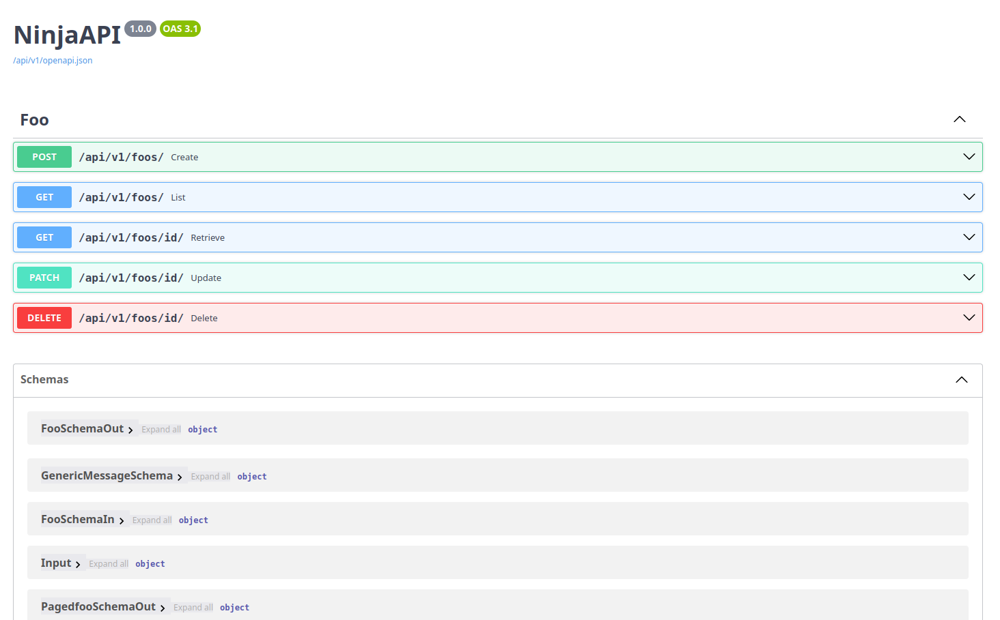

# 🥷 Django Ninja Aio CRUD

[](https://github.com/caspel26/django-ninja-aio-crud/actions)
[](https://codecov.io/gh/caspel26/django-ninja-aio-crud)
[](https://pypi.org/project/django-ninja-aio-crud/)
[](https://github.com/caspel26/django-ninja-aio-crud/blob/main/LICENSE)
[](https://github.com/astral-sh/ruff)

**Django Ninja Aio CRUD** is a powerful async REST framework built on top of [Django Ninja](https://django-ninja.dev/). It provides automatic CRUD operations, class-based views, and built-in utilities to make API development faster and cleaner.

## ✨ Key Features

- 🚀 **Fully Async** - Built for Django's async ORM
- 🔄 **Automatic CRUD** - Generate complete REST APIs with minimal code
- 📝 **ModelSerializer** - Define schemas directly on models
- 🎯 **Class-Based Views** - Clean, organized view architecture
- 🔐 **JWT Authentication** - Built-in async JWT bearer authentication
- 📄 **Auto Documentation** - OpenAPI/Swagger UI out of the box
- 🔗 **Relationship Support** - Automatic nested serialization (FK, M2M, reverse relations)
- 📊 **Pagination** - Built-in async pagination support
- ⚡ **Performance** - Using `orjson` for fast JSON serialization

## 🎯 Why Django Ninja Aio CRUD?

Traditional Django REST development requires:
- Separate serializer classes
- Manual CRUD view implementation
- Repetitive boilerplate code
- Complex relationship handling

**Django Ninja Aio CRUD** eliminates this complexity:

=== "Traditional Approach"
    ```python
    # serializers.py
    class UserSerializer(serializers.ModelSerializer):
        class Meta:
            model = User
            fields = ['id', 'username', 'email']
    
    class UserCreateSerializer(serializers.ModelSerializer):
        class Meta:
            model = User
            fields = ['username', 'email', 'password']
    
    # views.py
    class UserListView(APIView):
        async def get(self, request):
            users = await sync_to_async(list)(User.objects.all())
            serializer = UserSerializer(users, many=True)
            return Response(serializer.data)
    
    class UserCreateView(APIView):
        async def post(self, request):
            serializer = UserCreateSerializer(data=request.data)
            if serializer.is_valid():
                user = await sync_to_async(serializer.save)()
                return Response(UserSerializer(user).data)
            return Response(serializer.errors, status=400)
    
    # ... more views for retrieve, update, delete
    ```

=== "Django Ninja Aio CRUD"
    ```python
    # models.py
    class User(ModelSerializer):
        username = models.CharField(max_length=150)
        email = models.EmailField()
        password = models.CharField(max_length=128)
        
        class ReadSerializer:
            fields = ["id", "username", "email"]
        
        class CreateSerializer:
            fields = ["username", "email", "password"]
        
        class UpdateSerializer:
            optionals = [("email", str)]
    
    # views.py
    class UserViewSet(APIViewSet):
        model = User
        api = api
    
    UserViewSet().add_views_to_route()
    # Done! List, Create, Retrieve, Update, Delete endpoints ready
    ```

## 📦 Installation

```bash
pip install django-ninja-aio-crud
```

**Requirements:**
- Python 3.8+
- Django 4.1+ (for async ORM support)
- django-ninja

## 🚀 Quick Start

### 1. Create Your Model

Define your model using `ModelSerializer`:

```python
# models.py
from django.db import models
from ninja_aio.models import ModelSerializer


class Article(ModelSerializer):
    title = models.CharField(max_length=200)
    content = models.TextField()
    is_published = models.BooleanField(default=False)
    created_at = models.DateTimeField(auto_now_add=True)
    
    class ReadSerializer:
        fields = ["id", "title", "content", "is_published", "created_at"]
    
    class CreateSerializer:
        fields = ["title", "content"]
        optionals = [("is_published", bool)]
    
    class UpdateSerializer:
        optionals = [
            ("title", str),
            ("content", str),
            ("is_published", bool),
        ]
```

### 2. Create Your ViewSet

Define your API views using `APIViewSet`:

```python
# views.py
from ninja_aio import NinjaAIO
from ninja_aio.views import APIViewSet
from .models import Article

api = NinjaAIO(title="My Blog API", version="1.0.0")


class ArticleViewSet(APIViewSet):
    model = Article
    api = api


ArticleViewSet().add_views_to_route()
```

### 3. Configure URLs

Add the API to your URL configuration:

```python
# urls.py
from django.urls import path
from .views import api

urlpatterns = [
    path("api/", api.urls),
]
```

### 4. Run Your Server

```bash
python manage.py runserver
```

Visit **[http://localhost:8000/api/docs](http://localhost:8000/api/docs)** to see your auto-generated API documentation!

## 📸 Generated API Documentation

### Endpoints Overview



Your API automatically includes:

| Method | Endpoint | Description |
|--------|----------|-------------|
| `GET` | `/article/` | List all articles (paginated) |
| `POST` | `/article/` | Create new article |
| `GET` | `/article/{id}` | Retrieve single article |
| `PATCH` | `/article/{id}/` | Update article |
| `DELETE` | `/article/{id}/` | Delete article |

### List Endpoint


Features:
- Automatic pagination
- Query parameter filtering
- Sorting support

### Create Endpoint


Features:
- Input validation
- Custom field support
- Relationship handling

### Retrieve Endpoint


Features:
- Nested relationship serialization
- Optimized queries

### Update Endpoint


Features:
- Partial updates (PATCH)
- Field-level validation
- Custom actions

### Delete Endpoint


Features:
- Soft delete support
- Cascade handling
- Custom hooks

## 🎓 Next Steps

Ready to dive deeper? Check out our comprehensive guides:

### 📖 Tutorial Series

1. **[Getting Started](tutorial/getting_started.md)** - Set up your first project
2. **[Defining Models](tutorial/model.md)** - Master ModelSerializer
3. **[Creating CRUD Views](tutorial/crud.md)** - Build powerful APIs
4. **[Authentication](tutorial/authentication.md)** - Secure your endpoints

### 📚 Documentation

Explore detailed documentation for each component:

#### Models
- **[Model Serializer](models/model_serializer.md)** - Schema generation and serialization
- **[Model Util](models/model_util.md)** - Async CRUD utilities

#### Views
- **[API View](views/api_view.md)** - Simple custom views
- **[API View Set](views/api_view_set.md)** - Complete CRUD operations

#### Advanced Topics
- **[Authentication](authentication.md)** - JWT and custom auth
- **[Pagination](pagination.md)** - Customize pagination behavior

## 💡 Example: Complete Blog API

Here's a real-world example with relationships:

```python
# models.py
from django.db import models
from ninja_aio.models import ModelSerializer


class Author(ModelSerializer):
    name = models.CharField(max_length=200)
    email = models.EmailField(unique=True)
    bio = models.TextField(blank=True)
    
    class ReadSerializer:
        fields = ["id", "name", "email", "bio", "articles"]
    
    class CreateSerializer:
        fields = ["name", "email"]
        optionals = [("bio", str)]


class Category(ModelSerializer):
    name = models.CharField(max_length=100)
    slug = models.SlugField(unique=True)
    
    class ReadSerializer:
        fields = ["id", "name", "slug"]
    
    class CreateSerializer:
        fields = ["name", "slug"]


class Article(ModelSerializer):
    title = models.CharField(max_length=200)
    slug = models.SlugField(unique=True)
    content = models.TextField()
    author = models.ForeignKey(Author, on_delete=models.CASCADE, related_name="articles")
    category = models.ForeignKey(Category, on_delete=models.SET_NULL, null=True)
    tags = models.ManyToManyField('Tag', related_name="articles")
    is_published = models.BooleanField(default=False)
    views = models.IntegerField(default=0)
    created_at = models.DateTimeField(auto_now_add=True)
    
    class ReadSerializer:
        fields = [
            "id", "title", "slug", "content",
            "author", "category", "tags",
            "is_published", "views", "created_at"
        ]
    
    class CreateSerializer:
        fields = ["title", "slug", "content", "author", "category"]
        customs = [("notify_subscribers", bool, True)]
    
    class UpdateSerializer:
        optionals = [
            ("title", str),
            ("content", str),
            ("is_published", bool),
        ]
    
    async def custom_actions(self, payload: dict):
        if payload.get("notify_subscribers"):
            # Send notifications
            await notify_new_article(self)


class Tag(ModelSerializer):
    name = models.CharField(max_length=50, unique=True)
    
    class ReadSerializer:
        fields = ["id", "name"]


# views.py
from ninja_aio import NinjaAIO
from ninja_aio.views import APIViewSet
from .models import Author, Category, Article, Tag

api = NinjaAIO(title="Blog API", version="1.0.0")


class AuthorViewSet(APIViewSet):
    model = Author
    api = api


class CategoryViewSet(APIViewSet):
    model = Category
    api = api


class ArticleViewSet(APIViewSet):
    model = Article
    api = api
    query_params = {
        "is_published": (bool, None),
        "category": (int, None),
        "author": (int, None),
    }
    
    async def query_params_handler(self, queryset, filters):
        if filters.get("is_published") is not None:
            queryset = queryset.filter(is_published=filters["is_published"])
        if filters.get("category"):
            queryset = queryset.filter(category_id=filters["category"])
        if filters.get("author"):
            queryset = queryset.filter(author_id=filters["author"])
        return queryset


class TagViewSet(APIViewSet):
    model = Tag
    api = api


# Register all views
AuthorViewSet().add_views_to_route()
CategoryViewSet().add_views_to_route()
ArticleViewSet().add_views_to_route()
TagViewSet().add_views_to_route()
```

This creates a complete blog API with:
- 4 models with relationships
- Automatic nested serialization
- Query filtering
- Custom actions
- Full CRUD operations for all models

## 🌟 Key Concepts

### ModelSerializer

Central to Django Ninja Aio CRUD - defines schemas directly on models:

```python
class User(ModelSerializer):
    username = models.CharField(max_length=150)
    
    class ReadSerializer:
        fields = ["id", "username"]  # Response schema
    
    class CreateSerializer:
        fields = ["username"]  # Input schema
    
    class UpdateSerializer:
        optionals = [("username", str)]  # Partial update schema
```

### APIViewSet

Automatically generates complete CRUD endpoints:

```python
class UserViewSet(APIViewSet):
    model = User
    api = api
    # Generates: List, Create, Retrieve, Update, Delete
```

### Custom Views

Extend with custom endpoints:

```python
class UserViewSet(APIViewSet):
    model = User
    api = api
    
    def views(self):
        @self.router.post("/{pk}/activate/")
        async def activate(request, pk: int):
            user = await User.objects.aget(pk=pk)
            user.is_active = True
            await user.asave()
            return {"message": "User activated"}
```

## 🤝 Contributing

We welcome contributions! Here's how you can help:

1. **Report Bugs** - Open an issue on [GitHub](https://github.com/caspel26/django-ninja-aio-crud/issues)
2. **Suggest Features** - Share your ideas
3. **Submit PRs** - Improve code, docs, or tests
4. **Improve Documentation** - Help others learn

## 📄 License

This project is licensed under the MIT License - see the [LICENSE](https://github.com/caspel26/django-ninja-aio-crud/blob/main/LICENSE) file for details.

## ☕ Support

If you find Django Ninja Aio CRUD useful, consider supporting the project:

[](https://buymeacoffee.com/caspel26)

## 🔗 Links

- **Documentation:** [https://caspel26.github.io/django-ninja-aio-crud/](https://caspel26.github.io/django-ninja-aio-crud/)
- **GitHub:** [https://github.com/caspel26/django-ninja-aio-crud](https://github.com/caspel26/django-ninja-aio-crud)
- **PyPI:** [https://pypi.org/project/django-ninja-aio-crud/](https://pypi.org/project/django-ninja-aio-crud/)
- **Django Ninja:** [https://django-ninja.dev/](https://django-ninja.dev/)

---

Built with ❤️ using [Django Ninja](https://django-ninja.dev/)