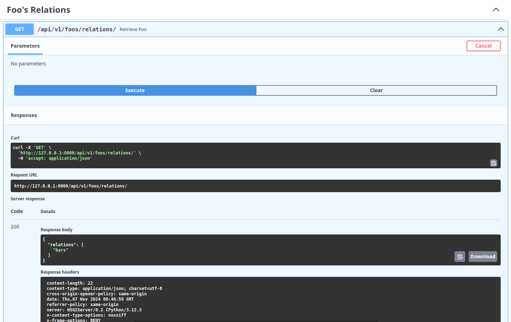

Model Util class is a NinjaAIO built-in utility class. It gives a lot of utilities for CRUD operations or normal Models operations. Let's give a look on its methods.

## get_object

Parameters:

    request: HttpRequest
    pk: int | str

Return:

    Model | ModelSerializer

What it does:
    This method prepares the object query and excutes it asynchronously. If the model is an instance of ModelSerializer it will execute actions defined into **queryset_request** method. It prepares queries also with prefetched relations using Model Util method **get_reverse_relations**, that is usefull to retrieve also the reverse relations and work with them asynchronously.

Example

```Python
# views.py
from ninja import Schema
from ninja_aio import NinjaAIO
from ninja_aio.models import ModelUtil
from ninja_aio.schemas import GenericMessageSchema
from ninja_aio.views import APIView
from django.http import HttpRequest

from . import models

api = NinjaAIO()


class FooSchemaOut(Schema):
    id: int
    name: str
    active: bool


class FooRetrieveView(APIView):
    api = api
    api_route_path = "foos/"
    router_tag = "Retrieve Foo"

    def views(self):
        @self.router.get(
            "{id}/",
            response={
                200: FooSchemaOut,
                self.error_codes: GenericMessageSchema,
            },
        )
        async def retrieve_foo(request: HttpRequest, id: int):
            foo_util = ModelUtil(models.Foo)
            try:
                foo = await foo_util.get_object(request, id)
            except SerializeError as e:
                return e.status_code, e.error
            return 200, foo


FooRetrieveView().add_views_to_route()
```

## get_reverse_relations

Parameters:
    None

Return:
    list[str]

What it does:
    Retrieve all the reverse relations based on model's fields. If the model is instance of Model it will retrieve them on all model's fields, if it is instance of ModelSerializer it will retrieve them based on fields given into ReadSerializer. This method is called into **get_object** method also.

Example

```Python
# models.py
from ninja_aio.models import ModelSerializer
from django.db import models


class Foo(ModelSerializer):
    name = models.CharField(max_length=30)

    class ReadSerializer:
    fields = ["id", "name", "bars"]

    class CreateSerializer:
    fields = ["name"]

    class UpdateSerializer:
    fields = ["name"]


class Bar(ModelSerializer):
    name = models.CharField(max_length=30)
    foo = models.ForeignKey(Foo, on_delete=models.CASCADE, related_name="bars")

    class ReadSerializer:
    fields = ["id", "name", "foo"]

    class CreateSerializer:
    fields = ["name", "foo"]

    class UpdateSerializer:
    fields = ["name"]
```

```Python
# views.py
from ninja import Schema
from ninja_aio import NinjaAIO
from ninja_aio.models import ModelUtil
from ninja_aio.schemas import GenericMessageSchema
from ninja_aio.views import APIView
from django.http import HttpRequest

from . import models

api = NinjaAIO()


class RelationsSchemaOut(Schema):
    relations: list[str]


class FooRelationsView(APIView):
    api = api
    api_route_path = "foos/relations/"
    router_tag = "Foo's Relations"

    def views(self):
        @self.router.get(
            "/",
            response={
                200: RelationsSchemaOut,
                self.error_codes: GenericMessageSchema,
            },
        )
        async def retrieve_foo(request: HttpRequest):
            foo_util = ModelUtil(models.Foo)
            return 200, foo_util.get_reverse_relations()


FooRelationsView().add_views_to_route()
```

